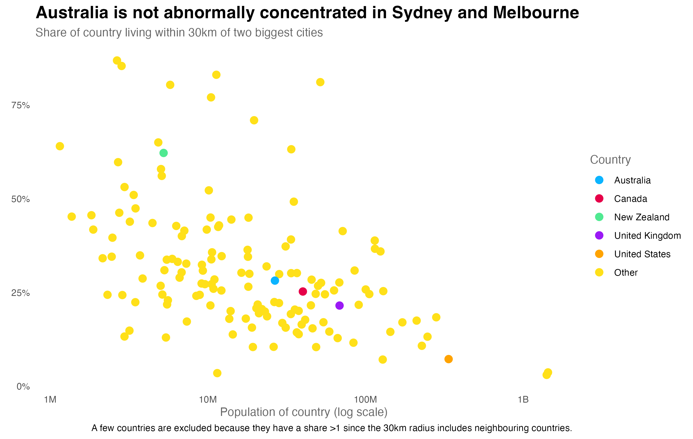
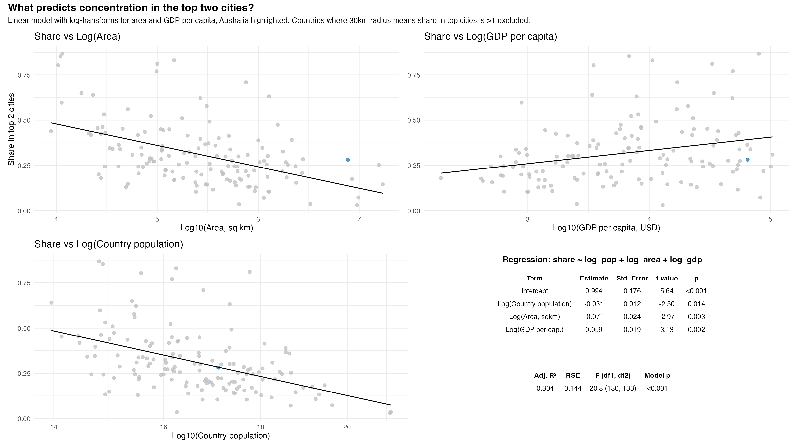

# Top Cities Analysis

An R analysis examining urban concentration patterns across countries, specifically investigating the share of national population living within 30km of the two largest cities.



## Overview

This project analyzes whether Australia's concentration in Sydney and Melbourne is abnormally high compared to other countries worldwide. The analysis uses multiple regression to identify predictors of urban concentration, controlling for country population, land area, and GDP per capita.

## Key Findings

- **Australia is not abnormally concentrated** in its top two cities when compared to similar countries
- **Country size, wealth, and population** are significant predictors of urban concentration
- Countries with smaller land areas tend to have higher concentration in their top cities
- Wealthier countries (higher GDP per capita) show different concentration patterns



*Additional visualizations for different radius distances (20km, 50km, 100km) are available in the `atlas/` folder.*

## Data Sources

### Primary Dataset
- **City Density Data**: [www.citydensity.com)
  - Contains population data for cities within various radius distances
  - Used to calculate population within 30km of top two cities per country

### World Bank Indicators (via WDI package)
- **Population Data**: `SP.POP.TOTL` - Total population by country (2023)
- **GDP Per Capita**: `NY.GDP.PCAP.CD` - GDP per capita, current US$ (2023)  
- **Land Area**: `AG.SRF.TOTL.K2` - Land area in square kilometers (latest available year)

## Methodology

1. **Data Preparation**
   - Filter city data to 30km radius from city centers
   - Identify top two cities by population per country
   - Calculate cumulative population within 30km of these cities
   - Merge with World Bank country-level indicators

2. **Analysis Approach**
   - Calculate share of national population in top two cities
   - Exclude countries where 30km radius creates share >1 (due to cross-border effects)
   - Apply log transformations to normalize skewed variables
   - Fit linear regression: `share ~ log(population) + log(area) + log(gdp_per_capita)`

3. **Visualization**
   - Scatter plots showing relationships between predictors and urban concentration
   - Highlight Australia compared to other countries
   - Regression table with model statistics

## Files

- `top_two_cities_analysis.R` - Main analysis script
- `ggplot_theme.R` - Custom ggplot2 theme and color palettes
- `atlas/` - Generated visualizations
  - `concentration_by_country_30.png` - Urban concentration by country (30km radius)
  - `share_predictors_30km.png` - Regression analysis plot (30km radius)
  - Additional plots for 20km, 50km, and 100km radius distances

## Dependencies

```r
library(tidyverse)    # Data manipulation and visualization
library(scales)       # Scale functions for plots
library(broom)        # Tidy model outputs
library(gridExtra)    # Arrange multiple plots
library(grid)         # Grid graphics
library(patchwork)    # Combine plots
library(WDI)          # World Bank data access
```

## Usage

1. Ensure all required packages are installed
2. Run `source("ggplot_theme.R")` to load custom themes
3. Execute `top_two_cities_analysis.R` to reproduce the analysis
4. Generated plots will be saved to the `atlas/` directory

## Model Results

The regression analysis reveals:
- **Adjusted R²**: 0.447 (model explains ~45% of variance)
- **Significant predictors**: All three variables (population, area, GDP) are statistically significant
- **Australia's position**: Falls within expected range given its characteristics

## License

This analysis uses publicly available data from the World Bank and city density datasets. Code is available for educational and research purposes.
